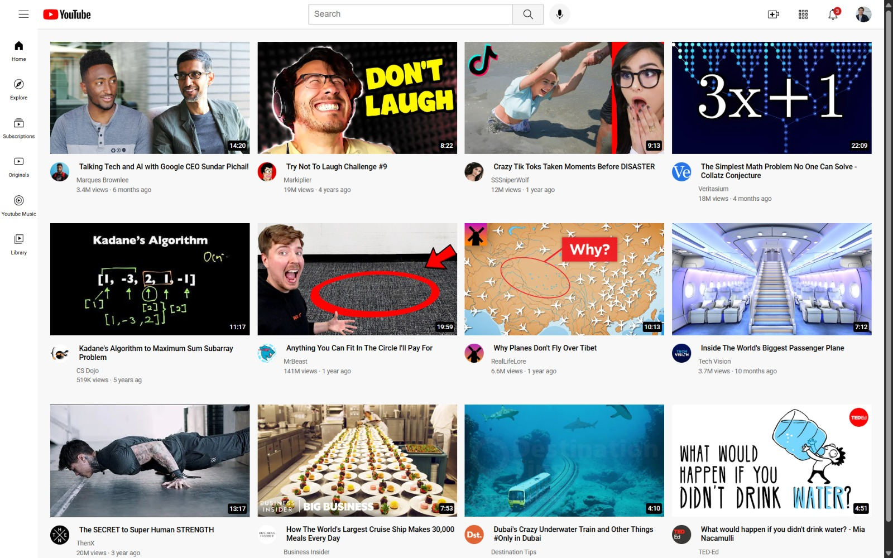

# YouTube Clone

A responsive YouTube homepage clone built using HTML5 and CSS3.

This project was created to practice modern frontend development concepts including responsive web design, CSS Grid, Flexbox, media queries, fixed positioning, and component-based layouts.

---

## Live Demo

https://vishu-py.github.io/YouTube-clone/

---

## Preview



---

## Features

- Responsive video grid layout
- Fixed navigation header
- Fixed sidebar navigation
- Video thumbnail overlays with timestamps
- Responsive design using media queries
- CSS Grid for content layout
- Flexbox for header and navigation sections
- Organized project structure with separate CSS files

---

## Technologies Used

- HTML5
- CSS3
- CSS Grid
- Flexbox
- Media Queries
- Git
- GitHub

---

## Project Structure

```text
YouTube-clone/
│
├── icons/
├── profilePics/
├── thumbnails/
├── styles/
│   ├── general.css
│   ├── header.css
│   ├── sidebar.css
│   └── video.css
│
├── index.html
└── README.md
```

---

## What I Learned

Through this project I gained hands-on experience with:

- Building responsive layouts
- Using CSS Grid and Flexbox effectively
- Working with media queries
- Creating reusable UI components
- Structuring frontend projects
- Using Git and GitHub for version control

---

## Future Improvements

- Add hover effects and animations
- Improve accessibility
- Add JavaScript functionality
- Create a fully interactive search bar
- Build additional YouTube pages
- Convert the project into a React application

---

## Author

Vaishnavi Singh

GitHub: https://github.com/vishu-py